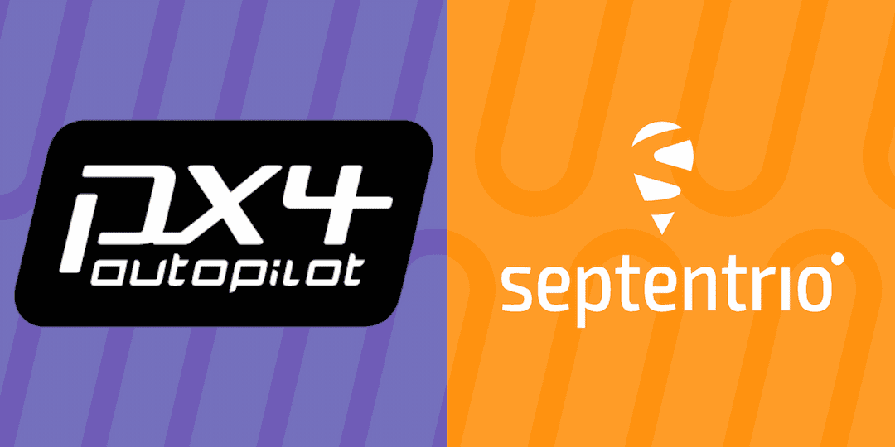

# PX4 Autopilot

This repository is a fork from the official [PX4-Autopilot](https://github.com/PX4/PX4-Autopilot)
with verified drivers for Septentrio receivers. PX4 is highly portable, OS-independent and supports
Linux, NuttX and MacOS out of the box.

- Official Website: http://px4.io (License: BSD 3-clause, LICENSE)
- Supported airframes (portfolio):
  - Multicopters
  - Fixed wing
  - VTOL
  - Autogyro
  - Rover
  - many more experimental types (Blimps, Boats, Submarines, High altitude balloons, etc)

## Getting Started

To get started with PX4 and a Septentrio receiver, follow the [getting
started](docs/getting_started.md) guide.

## Building a PX4 based drone, rover, boat or robot

The [PX4 User Guide](https://docs.px4.io/main/en/) explains how to assemble [supported
vehicles](https://docs.px4.io/main/en/airframes/airframe_reference.html) and fly drones with PX4.
See the [forum and chat](https://docs.px4.io/main/en/#getting-help) if you need help!

### Releases

The releases on this repository are verified by Septentrio. Every Septentrio release ends with
"-septentrio". Other releases are verified by PX4 but may not support Septentrio receivers.

On the release page you can download the builds for every default supported boards. Just upload this
build to your board using QGroundControl and you are ready to fly!

_To see the changes from a specific release, go to the release page and open the "Full Changelog"
link._

## Building your own code

If you made changes to the code and want to build it yourself, you first have to set up a developer
environment. Check [Setting up a Developer
Environment](https://docs.px4.io/master/en/dev_setup/dev_env.html) on how to do so. It is
recommended to use Ubuntu Linux as the devopment platform.

After you have the developer environment set up, run the make command with the right build target.
ex:
* Pixhawk4: `make px4_fmu-v5_default`

For other build targets and simulations, visit the [Building PX4
Software](https://docs.px4.io/master/en/dev_setup/building_px4.html) page on the PX4 user guide.

## Supported Hardware

Pixhawk standard boards and proprietary boards are shown below (discontinued boards aren't listed).

For the most up to date information, please visit [PX4 user Guide > Autopilot
Hardware](https://docs.px4.io/main/en/flight_controller/).

### Septentrio Receivers

* [mosaic-go heading GNSS module evaluation kit](https://web.septentrio.com/l/858493/2022-04-19/xgrp9)
* [mosaic-go GNSS module receiver evaluation kit](https://web.septentrio.com/l/858493/2022-04-19/xgrpd)
* [AsteRx-m3 Pro](https://web.septentrio.com/l/858493/2022-04-19/xgrrz)
* [AsteRx-m3 Pro+](https://web.septentrio.com/l/858493/2022-04-19/xgrs3)

### Pixhawk Standard Boards
* FMUv5 and FMUv5X (STM32F7, 2019/20)
    * [Pixhawk 4 (FMUv5)](https://docs.px4.io/master/en/flight_controller/pixhawk4.html)
    * [Pixhawk 4 mini (FMUv5)](https://docs.px4.io/master/en/flight_controller/pixhawk4_mini.html)
    * [CUAV V5+ (FMUv5)](https://docs.px4.io/master/en/flight_controller/cuav_v5_plus.html)
    * [CUAV V5 nano (FMUv5)](https://docs.px4.io/master/en/flight_controller/cuav_v5_nano.html)
    * [Auterion Skynode (FMUv5X)](https://docs.px4.io/master/en/flight_controller/auterion_skynode.html)
* FMUv4 (STM32F4, 2015)
    * [Pixracer](https://docs.px4.io/master/en/flight_controller/pixracer.html)
    * [Pixhawk 3 Pro](https://docs.px4.io/master/en/flight_controller/pixhawk3_pro.html)
* FMUv3 (STM32F4, 2014)
    * [Pixhawk 2](https://docs.px4.io/master/en/flight_controller/pixhawk-2.html)
    * [Pixhawk Mini](https://docs.px4.io/master/en/flight_controller/pixhawk_mini.html)
    * [CUAV Pixhack v3](https://docs.px4.io/master/en/flight_controller/pixhack_v3.html)
* FMUv2 (STM32F4, 2013)
    * [Pixhawk](https://docs.px4.io/master/en/flight_controller/pixhawk.html)
    * [Pixfalcon](https://docs.px4.io/master/en/flight_controller/pixfalcon.html)

Additional information about supported hardware can be found in [PX4 user Guide > Autopilot
Hardware](https://docs.px4.io/master/en/flight_controller/).